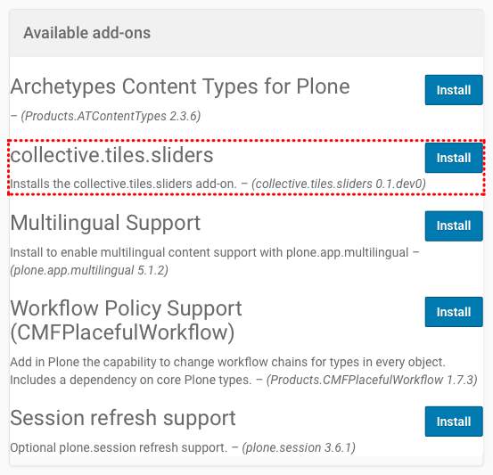
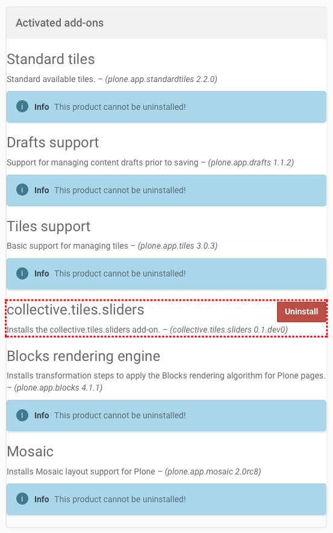

Installation and Configuration
==============================

Install the Add-On
------------------

You can install the Add-On like any other Plone Add-On: click on your username in the *personal tools menu* and select **Site Setup**.
Next, click the **Add-Ons** item in the *Plone Configuration* section.
You should see an item called **collective.tiles.sliders**.

You can remove **collective.tiles.sliders** again from your Plone site by clicking the uninstall button next to the add-on:

